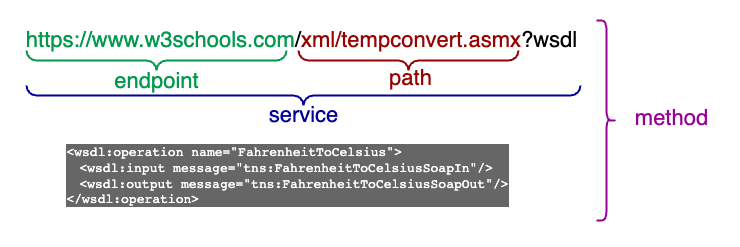
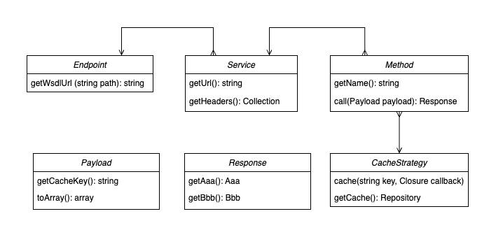
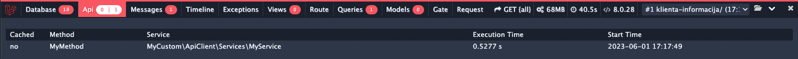

# API Client

This package defines contracts and provides abstract partial implementations of those contracts. It is meant to be used as a base for your own highly modular and customisable implementation of API consumption.

## Installation

You can install the package via composer:

```bash
composer require cubesystems/api-client
```

## Configuration

To use Laravel Debugbar integration, enable it within `debugbar.php` config file:

```php
return [
    ...
    'collectors' => [
        ...
        'api' => true
    ]
];
```

## Making custom API client implementation

First of all, let's define some vocabulary:

 *Methods, services and endpoints*

After this, we can look at the relations between all interfaces:

 *Relationship between interfaces*

### Define an endpoint

For this, we need to implement `CubeSystems\ApiClient\Client\Contracts\Endpoint` contract which can be done by extending `CubeSystems\ApiClient\Client\AbstractEndpoint` class:

```php
use CubeSystems\ApiClient\Client\AbstractEndpoint;

class MyEndpoint extends AbstractEndpoint {}
```

### Define a service accessible within an endpoint

For this, we need to implement `CubeSystems\ApiClient\Client\Contracts\Service` contract which can be done by extending `CubeSystems\ApiClient\Client\AbstractService` class:

```php
use CubeSystems\ApiClient\Client\AbstractService;
use Illuminate\Support\Collection;

class MyService extends AbstractService
{
    protected const SERVICE_PATH = 'path/to/service';

    public function __construct(
        MyEndpoint $endpoint,
        Collection $headers
    ) {
        parent::__construct($endpoint, $headers);
    }
}
```

### Create a request payload class

This can be done by implementing `CubeSystems\ApiClient\Client\Contracts\Payload` contract directly or by extending `CubeSystems\ApiClient\Client\Payloads\AbstractPayload` class:
```php
use CubeSystems\ApiClient\Client\Payloads\AbstractPayload;

class MyPayload extends AbstractPayload
{
    private string $parameter;

    public function setId(string $id): MyPayload
    {
        $this->id = $id;

        return $this;
    }

    public function toArray(): array
    {
        return [
            'id' => $this->id
        ];
    }

    public function getCacheKey(): string
    {
        return self::class . $this->id;
    }
}
```

### Create a response class

This can be done by implementing `CubeSystems\ApiClient\Client\Contracts\Response` contract directly or by extending `CubeSystems\ApiClient\Client\Responses\AbstractResponse` class:

```php
use CubeSystems\ApiClient\Client\Responses\AbstractResponse;

class MyResponse extends AbstractResponse
{
    private MyDto $myDto;

    public function getMyDto(): MyDto
    {
        return $this->myDto;
    }

    public function setMyDto(MyDto $myDto): MyResponse
    {
        $this->myDto = $myDto;

        return $this;
    }
}
```

### Create a method for a service

`CubeSystems\ApiClient\Client\Contracts\Method` is implemented by `CubeSystems\ApiClient\Client\Methods\AbstractMethod` class.

```php
use CubeSystems\ApiClient\Client\Methods\AbstractMethod;
use CubeSystems\ApiClient\Client\Strategies\NeverCacheStrategy;
use Illuminate\Support\Arr;

class MyMethod extends AbstractMethod
{
    protected const METHOD_NAME = 'MyMethod';

    public function __construct(
        MyService $service,
        NeverCacheStrategy $cacheStrategy
    ) {
        parent::__construct($service, $cacheStrategy);
    }
    
    protected function toResponse(array $rawResponse, int $httpCode): MyResponse
    {
        $response = new MyResponse();
        ...
        $myDto = new MyDto();
        $myDto->setName(Arr::get($rawResponse, 'name'));
        $myDto->setAge((int) Arr::get($rawResponse, 'age'));
        $response->setDto($myDto);
        
        return $response;
    }
}
```

## Calling an API

After all that, you can make calls like this:

```php
use Foo\Endpoints\MyEndpoint;
use Foo\Services\MyService;
use Foo\Methods\MyMethod;
use Foo\Payloads\MyPayload;

class MyRepository
{
    public function getMyDtoById(string $id): MyDto
    {
        $myEndpoint = new MyEndpoint(config('api-client.endpoints.myEndpoint.url'));
        $myService = new MyService($myEndpoint, collect());
        $myMethod = new MyMethod($myService, new NeverCacheStrategy());
        $myPayload = new MyPayload();
        $myPayload->setId($id);
        
        return $myMethod->call($myPayload)->getMyDto();
    }
}

```

Or take advantage of dependency injection done by Laravel.

Extend `CubeSystems\ApiClient\ApiClientServiceProvider` class and register your bindings:

```php
public function register(): void
{
    parent::register();
    
    $this->app->singleton(MyEndpoint::class, function (Application $app) {
        $url = config('api-client.endpoints.myEndpoint.url');

        return new MyEndpoint($url);
    });
}
```

Now the same thing can be done more concisely:

```php
use Foo\Methods\MyMethod;
use Foo\Payloads\MyPayload;

class MyRepository
{
    public function getMyDtoById(string $id): MyDto
    {
        $myMethod = app(MyMethod::class);
        $myPayload = new MyPayload();
        $myPayload->setId($id);
        
        return $myMethod->call($myPayload)->getMyDto();
    }
}
```

Take a look at tests for more detailed examples.

## Caching

`AbstractMethod` class includes a caching mechanism. Just pass desired cache strategy to the constructor. There are 3 strategies available:
* `CubeSystems\ApiClient\Client\Cache\NeverCacheStrategy` - never cache the response
* `CubeSystems\ApiClient\Client\Cache\RequestCacheStrategy` - cache the response for the duration of the request
* `CubeSystems\ApiClient\Client\Cache\TimeIntervalCacheStrategy` - cache the response for a given time interval

You can also create your own strategy by implementing `CubeSystems\ApiClient\Client\Contracts\CacheStrategy` contract.

`CubeSystems\ApiClient\Client\Contracts\Payload::getCacheKey()` method is used to decide if there are valid cache entries for a given payload. If there are, the response is retrieved from cache. Otherwise, the remote API is called.

### Hierarchical caching

If payload returns `true` from `isUsingCacheHierarchy` method, then corresponding call will be made part of the cache hierarchy. This allows to invalidate all cache entries for given hierarchy at once by calling `AbstractMethod`'s `removeHierarchyFromCache` method.

For this to work, `CubeSystems\ApiClient\Client\Contracts\Payload::getCacheHierarchyKey` method must be implemented according to your needs.

Moreover, `AbstractPayload` now accepts optional `CachePrefix` parameter which can be used to differentiate between cache hierarchies for the same _type_ of method and payload. Typical use case would be to distinguish between different users' cache hierarchies.

## There is more

### Events

`CubeSystems\ApiClient\Client\Methods\AbstractMethod` class fires the following events:
* `CubeSystems\ApiClient\Events\ApiCalled` - after a remote API is called
* `CubeSystems\ApiClient\Events\ResponseRetrievedFromCache` - after response is retrieved from cache without calling a remote API

You can listen to those and do some additional stuff like logging.


### Laravel Debugbar integration
If `debugbar.collectors.api` configuration option is set to `true` as described above, all API calls (and cache retrievals) will be visible within Laravel Debugbar:

 *Debugbar integration*

## Testing

This package uses [Pest testing framework](https://pestphp.com/). You can run tests with

```bash
composer test
```

## Changelog

Please see [CHANGELOG](CHANGELOG.md) for more information on what has changed recently.
